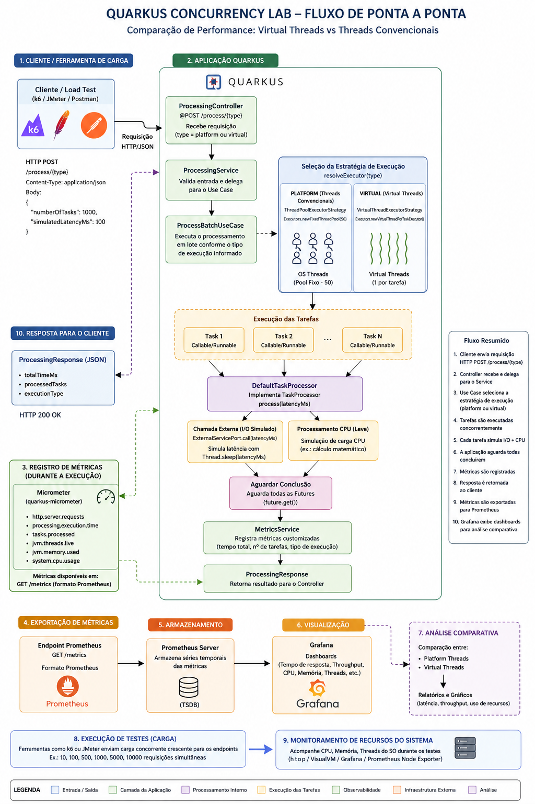

# ⚡ Quarkus Concurrency Lab

Plataforma de **simulação e benchmark de concorrência** que compara o desempenho de **Virtual Threads (Project Loom)** vs **Platform Threads (pool fixo)** em cenários realistas de carga — I/O-bound e CPU-bound.

Desenvolvido com **Java 21**, **Quarkus 3** e **Micrometer**, seguindo princípios de **Clean Architecture**. Observabilidade completa via **Prometheus + Grafana** e scripts de carga com **k6**.

---

## 📊 Diagrama de Fluxo



---

## 🏗️ Arquitetura

```
┌─────────────────────────────────────────────────────────┐
│                      application                        │  ← Controller, Service, Use Case, DTOs
├─────────────────────────────────────────────────────────┤
│                        domain                           │  ← Ports (interfaces)
├─────────────────────────────────────────────────────────┤
│                    infrastructure                       │  ← Executors, Adapters, Metrics
└─────────────────────────────────────────────────────────┘
```

### Fluxo de uma requisição

```
POST /process/{type}
        │
        ▼
ProcessingController
        │
        ▼
ProcessBatchUseCase ──── resolve tipo ────┐
        │                                 │
        │              "virtual"          │   "platform"
        │                 ▼               │       ▼
        │    VirtualThreadExecutorStrategy │  ThreadPoolExecutorStrategy
        │    (novo executor por batch)     │  (pool fixo singleton — 50 threads)
        │                 └───────────────┘
        │                         │
        │                         ▼
        │                DefaultTaskProcessor
        │                         │
        │                         ▼
        │               ExternalServiceAdapter
        │               (Thread.sleep → I/O simulado)
        │
        ▼
  MetricsService ──► Prometheus ──► Grafana
```

---

## 🚀 Sobre o Projeto

O benchmark submete **N tarefas em paralelo** a dois modelos de concorrência e mede:

- **Tempo total do batch** (wall-clock time)
- **Tempo médio por tarefa** (coletado dentro de cada task)
- **Throughput** (tarefas/segundo)
- **Percentis p50, p90, p99** via k6

Cada tarefa simula um cenário misto:
1. **I/O-bound** — `Thread.sleep(latencyMs)` representando chamada a API/banco
2. **CPU-bound leve** — `Math.sqrt(random)` para simular processamento mínimo

Ao final de cada execução do k6, um **relatório HTML interativo** é gerado automaticamente com gráficos comparativos, glossário e análise dos resultados.

---

## 🧰 Tecnologias

| Tecnologia | Versão | Uso |
|---|---|---|
| Java | 21 (LTS) | Linguagem principal + Virtual Threads (Project Loom) |
| Quarkus | 3.33 | Framework base — startup ultrarrápido, low memory |
| Quarkus REST (RESTEasy Reactive) | — | Endpoints HTTP |
| Micrometer + Prometheus | — | Coleta e exposição de métricas |
| SmallRye Health | — | Health check (`/q/health`) |
| SmallRye OpenAPI | — | Documentação automática (`/q/openapi`) |
| Mutiny | — | Suporte a programação reativa (Quarkus) |
| k6 | 0.55+ | Ferramenta de carga e geração do relatório HTML |
| Prometheus | 2.52 | Armazenamento de séries temporais de métricas |
| Grafana | 10.4 | Dashboard de observabilidade |
| Docker + Compose | — | Infraestrutura local (Prometheus + Grafana) |
| Maven Wrapper | 3.9.12 | Build sem dependência de Maven instalado |

---

## 🧩 Design Patterns

| Pattern | Onde é aplicado |
|---|---|
| **Clean Architecture** | Separação total entre domínio, aplicação e infraestrutura |
| **Ports & Adapters** | `TaskProcessor` e `ExternalServicePort` (portas) → implementações na infra |
| **Strategy** | `ThreadPoolExecutorStrategy` e `VirtualThreadExecutorStrategy` — trocam o modelo de execução |
| **Use Case** | `ProcessBatchUseCase` encapsula a orquestração do benchmark |
| **Singleton (CDI)** | `ThreadPoolExecutorStrategy` cria o pool uma única vez via `@PostConstruct` |

---

## 📁 Estrutura do Projeto

```
quarkus-concurrency-lab/
├── src/main/java/org/leonardo/quarkusconcurrencylab/
│   ├── application/
│   │   ├── controller/ProcessingController.java   # POST /process/{type}
│   │   ├── dto/
│   │   │   ├── ProcessingRequest.java             # numberOfTasks, simulatedLatencyMs
│   │   │   └── ProcessingResponse.java            # totalTimeMs, throughputRps, avgTaskTimeMs...
│   │   ├── service/ProcessingService.java
│   │   └── usecase/ProcessBatchUseCase.java        # orquestra o batch e coleta métricas
│   ├── domain/
│   │   └── port/
│   │       ├── TaskProcessor.java                 # porta: long process(int latencyMs)
│   │       └── ExternalServicePort.java           # porta: void call(int latencyMs)
│   ├── infrastructure/
│   │   ├── executor/
│   │   │   ├── ThreadPoolExecutorStrategy.java    # pool fixo singleton (50 threads)
│   │   │   └── VirtualThreadExecutorStrategy.java # virtual thread por tarefa
│   │   ├── external/
│   │   │   ├── DefaultTaskProcessor.java          # implementa TaskProcessor
│   │   │   └── ExternalServiceAdapter.java        # implementa ExternalServicePort (Thread.sleep)
│   │   └── metrics/
│   │       └── MetricsService.java                # Timer + Counter via MeterRegistry
│   └── shared/
│       └── enums/ExecutionType.java
│
├── docker/
│   ├── docker-compose.yml                         # Prometheus + Grafana
│   ├── prometheus.yml                             # scrape config (porta 8080, a cada 5s)
│   └── grafana/provisioning/
│       ├── datasources/prometheus.yml
│       └── dashboards/
│           ├── dashboard.yml
│           └── concurrency-lab.json               # dashboard pré-configurado
│
├── k6/
│   ├── lib/report.js                              # gerador do relatório HTML
│   ├── scenarios/
│   │   ├── io-heavy.js                            # benchmark I/O (3 fases de carga)
│   │   └── cpu-heavy.js                           # benchmark CPU
│   ├── load-test.js                               # teste básico rápido
│   └── run.ps1                                    # runner com abertura automática do relatório
│
└── src/main/resources/
    ├── application.yml
    └── META-INF/resources/
        └── k6-report.html                         # gerado automaticamente ao rodar o k6
```

---

## ⚙️ Pré-requisitos

| Ferramenta | Versão mínima | Observação |
|---|---|---|
| JDK | 21 (LTS) | [Temurin 21](https://adoptium.net/) recomendado |
| Docker Desktop | 4.x | Para subir Prometheus + Grafana |
| k6 | 0.55+ | Ver instalação abaixo |

> O **Maven** não precisa estar instalado — o projeto usa o Maven Wrapper (`mvnw`).

---

## 📦 Instalação do k6

### Windows

**Opção 1 — winget** *(recomendado)*
```powershell
winget install k6 --source winget
```
Após instalar, recarregue o PATH na sessão atual sem fechar o terminal:
```powershell
$env:PATH = [System.Environment]::GetEnvironmentVariable("PATH","Machine") + ";" +
            [System.Environment]::GetEnvironmentVariable("PATH","User")
k6 version
```

**Opção 2 — download direto**
```powershell
Invoke-WebRequest `
  -Uri "https://github.com/grafana/k6/releases/download/v0.55.0/k6-v0.55.0-windows-amd64.zip" `
  -OutFile "$env:TEMP\k6.zip"
Expand-Archive "$env:TEMP\k6.zip" -DestinationPath "$env:TEMP\k6"
Copy-Item "$env:TEMP\k6\k6-v0.55.0-windows-amd64\k6.exe" -Destination "C:\Windows\System32\k6.exe"
k6 version
```

**Opção 3 — Chocolatey**
```powershell
choco install k6
```

---

### Linux

**Ubuntu / Debian**
```bash
sudo gpg --no-default-keyring \
  --keyring /usr/share/keyrings/k6-archive-keyring.gpg \
  --keyserver hkp://keyserver.ubuntu.com:80 \
  --recv-keys C5AD17C747E3415A3642D57D77C6C491D6AC1D69

echo "deb [signed-by=/usr/share/keyrings/k6-archive-keyring.gpg] https://dl.k6.io/deb stable main" \
  | sudo tee /etc/apt/sources.list.d/k6.list

sudo apt-get update && sudo apt-get install k6
k6 version
```

**Fedora / RHEL / CentOS**
```bash
sudo dnf install https://dl.k6.io/rpm/repo.rpm
sudo dnf install k6
k6 version
```

**Arch Linux**
```bash
sudo pacman -S k6
```

**Download direto (qualquer distro)**
```bash
curl -L https://github.com/grafana/k6/releases/download/v0.55.0/k6-v0.55.0-linux-amd64.tar.gz \
  | tar -xz
sudo mv k6-v0.55.0-linux-amd64/k6 /usr/local/bin/k6
k6 version
```

---

### macOS

**Homebrew** *(recomendado)*
```bash
brew install k6
k6 version
```

**MacPorts**
```bash
sudo port install k6
```

**Download direto**
```bash
curl -L https://github.com/grafana/k6/releases/download/v0.55.0/k6-v0.55.0-macos-amd64.zip -o k6.zip
unzip k6.zip
sudo mv k6-v0.55.0-macos-amd64/k6 /usr/local/bin/k6
k6 version
```

---

## ▶️ Executar Localmente

### 1. Clonar o repositório

```bash
git clone https://github.com/holandale0/quarkus-concurrency-lab.git
cd quarkus-concurrency-lab
```

### 2. Subir a stack de observabilidade

```bash
docker compose -f docker/docker-compose.yml up -d
```

Isso sobe:
- **Prometheus** → `http://localhost:9090`
- **Grafana** → `http://localhost:3000` (usuário: `admin` / senha: `admin`)

### 3. Iniciar a aplicação Quarkus

```bash
# Linux / macOS
./mvnw quarkus:dev

# Windows
.\mvnw quarkus:dev
```

> Na primeira execução o Maven Wrapper baixa automaticamente o Maven 3.9.12 (~10 MB). A aplicação sobe em `http://localhost:8080`.

### 4. Executar o benchmark

Abra um **segundo terminal** na raiz do projeto:

```powershell
# Windows — roda o k6 e abre o relatório HTML automaticamente no navegador
.\k6\run.ps1

# Escolher outro cenário
.\k6\run.ps1 -Scenario cpu-heavy

# Rodar sem abrir o navegador
.\k6\run.ps1 -NoBrowser
```

```bash
# Linux / macOS
k6 run k6/scenarios/io-heavy.js
```

Ao final, o relatório HTML é gerado automaticamente e pode ser acessado em:
```
http://localhost:8080/k6-report.html
```

---

## 🔬 Cenários de Teste

### `io-heavy` — I/O intensivo *(cenário principal)*

Simula o cenário onde Virtual Threads têm maior vantagem: tarefas que passam a maior parte do tempo **esperando** (chamadas a APIs, banco de dados, serviços externos).

| Fase | VUs | Tarefas/batch | Latência simulada | Duração |
|---|---|---|---|---|
| Baixa | 5 | 50 | 200 ms | 30 s |
| Média | 20 | 100 | 200 ms | 30 s |
| Alta | 50 | 500 | 200 ms | 30 s |

```bash
k6 run k6/scenarios/io-heavy.js
```

---

### `cpu-heavy` — CPU intensivo

Demonstra que Virtual Threads **não têm vantagem** quando o gargalo é o processador, não a espera por I/O.

| Fase | VUs | Tarefas/batch | Latência simulada | Duração |
|---|---|---|---|---|
| Baixa | 5 | 100 | 5 ms | 30 s |
| Alta | 20 | 500 | 5 ms | 30 s |

```bash
k6 run k6/scenarios/cpu-heavy.js
```

---

### `load-test` — Teste rápido

Teste básico para validar que a aplicação está respondendo corretamente antes de rodar os cenários completos.

```bash
k6 run k6/load-test.js
```

---

## 📡 API

| Método | Endpoint | Descrição |
|---|---|---|
| `POST` | `/process/virtual` | Executa batch com Virtual Threads |
| `POST` | `/process/platform` | Executa batch com Platform Threads (pool fixo) |
| `GET` | `/q/health` | Health check (liveness + readiness) |
| `GET` | `/q/metrics` | Métricas no formato Prometheus |
| `GET` | `/q/openapi` | Especificação OpenAPI |

### Corpo da requisição

```json
{
  "numberOfTasks": 100,
  "simulatedLatencyMs": 200
}
```

| Campo | Tipo | Descrição |
|---|---|---|
| `numberOfTasks` | `int` | Quantidade de tarefas executadas em paralelo |
| `simulatedLatencyMs` | `int` | Latência simulada por tarefa (em ms) — representa I/O |

### Exemplo de requisição

```bash
curl -X POST http://localhost:8080/process/virtual \
  -H "Content-Type: application/json" \
  -d '{"numberOfTasks": 100, "simulatedLatencyMs": 200}'
```

### Exemplo de resposta

```json
{
  "totalTimeMs": 1043,
  "processedTasks": 100,
  "executionType": "virtual",
  "avgTaskTimeMs": 203,
  "throughputRps": 95.9
}
```

| Campo | Descrição |
|---|---|
| `totalTimeMs` | Tempo total (wall-clock) para processar o batch inteiro |
| `processedTasks` | Número de tarefas executadas |
| `executionType` | Estratégia usada: `virtual` ou `platform` |
| `avgTaskTimeMs` | Tempo médio medido individualmente dentro de cada tarefa |
| `throughputRps` | Tarefas concluídas por segundo |

---

## 📈 Observabilidade

### Métricas expostas no Prometheus

| Métrica | Tipo | Tags | Descrição |
|---|---|---|---|
| `batch_processing_duration_seconds` | Timer | `execution_type` | Duração total de cada batch |
| `batch_tasks_total` | Counter | `execution_type` | Total acumulado de tarefas processadas |
| `jvm_threads_live_threads` | Gauge | — | Threads JVM ativas no momento |
| `jvm_memory_used_bytes` | Gauge | `area` | Memória heap/non-heap usada |

### Dashboard Grafana

Acesse `http://localhost:3000` (admin/admin). O dashboard **Quarkus Concurrency Lab** é provisionado automaticamente com os painéis:

| Painel | O que mostra |
|---|---|
| Latência p50/p99 por executor | Comparação de tempo de resposta entre virtual e platform |
| Throughput (tasks/sec) | Velocidade de processamento ao longo do tempo |
| Thread count JVM | Pico de threads ativas — revela o custo do pool fixo |
| Heap memory | Uso de memória durante os testes |

---

## 🔍 Relatório HTML do k6

Ao final de cada execução, o k6 gera automaticamente `src/main/resources/META-INF/resources/k6-report.html` — servido pelo Quarkus em `http://localhost:8080/k6-report.html`.

O relatório contém:

- **Resumo executivo** — total de requisições, taxa de erro, duração do teste
- **Cards comparativos** — virtual vs platform com todos os percentis lado a lado
- **Gráfico de barras** — duração por percentil (p50, p90, p99)
- **Gráfico de variação** — mín / média / máx de cada estratégia
- **Conclusão automática** — análise de qual abordagem ganhou e por quê
- **Glossário interativo** — explicação de todos os termos técnicos (VU, p99, Trend, I/O-bound, etc.)
- **Guia prático** — quando preferir cada abordagem

---

## 💡 Quando Usar Cada Abordagem?

### ✅ Prefira Virtual Threads quando:
- A aplicação faz muitas chamadas a bancos de dados, APIs externas ou microsserviços
- O tempo de espera (I/O) domina o processamento — tipicamente > 80% do tempo de uma requisição
- Você precisa de alta concorrência sem escalar horizontalmente
- Quer simplificar código assíncrono sem usar Reactive/Callback

### ⚠️ Tenha cuidado com Virtual Threads quando:
- O processamento é intensivo em CPU — o gargalo é o processador, não a espera
- O código usa blocos `synchronized` pesados (podem pinar o carrier thread)
- Cada tarefa dura menos de 1 ms (o overhead de criação pode superar o ganho)
- Você usa bibliotecas nativas que bloqueiam threads de forma não-interruptível

---

## ✅ Checklist

- [x] API REST com dois endpoints de benchmark (`/process/virtual`, `/process/platform`)
- [x] Virtual Threads via `Executors.newVirtualThreadPerTaskExecutor()` (Java 21)
- [x] Platform Threads via `Executors.newFixedThreadPool()` singleton com `@PostConstruct`
- [x] Coleta de métricas por tarefa (tempo médio, throughput)
- [x] Integração com Micrometer — Timer e Counter com tag `execution_type`
- [x] Configuração externalizável via `application.yml` (`processing.thread-pool.size`)
- [x] Docker Compose com Prometheus + Grafana
- [x] Dashboard Grafana pré-provisionado
- [x] Scripts k6 para 3 cenários (io-heavy, cpu-heavy, load-test)
- [x] Relatório HTML gerado automaticamente via `handleSummary` do k6
- [x] Maven Wrapper (sem necessidade de Maven instalado)
- [x] Clean Architecture (controller → service → use case → domain → infra)
- [ ] Testes unitários e de integração
- [ ] Endpoint reativo com Mutiny (`/process/reactive`)
- [ ] Benchmark com banco de dados real (JDBC bloqueante vs Virtual Threads)
- [ ] Suporte a Docker com limites de CPU (`--cpus`) para testes controlados
- [ ] Autenticação no endpoint

---

## 🚀 Roadmap

- **Modo reativo** — adicionar `/process/reactive` com Mutiny/Uni para comparação três vias
- **Banco de dados** — integrar PostgreSQL e comparar JDBC bloqueante vs Virtual Threads vs R2DBC
- **Kafka** — simular fila de mensagens e comparar estratégias de consumo paralelo
- **Testes** — cobertura com JUnit 5, Mockito e Testcontainers
- **Docker com CPU limitada** — `docker run --cpus 2` para benchmark em ambiente controlado
- **Comparação cross-framework** — benchmark equivalente em Spring Boot WebFlux

---

## 💬 Objetivo

Projeto de portfólio que demonstra **compreensão profunda de concorrência em Java 21**, indo além de simplesmente usar a tecnologia — **medindo, questionando e analisando os resultados** em diferentes cenários.

Mostra domínio de:
- **Concorrência avançada** — Virtual Threads, thread pools, diferença entre I/O-bound e CPU-bound
- **Arquitetura** — Clean Architecture com separação clara de responsabilidades
- **Observabilidade** — Micrometer, Prometheus, Grafana
- **Performance Engineering** — geração e análise de relatórios com k6
- **Ferramentas modernas** — Java 21, Quarkus 3, Docker, Maven Wrapper
